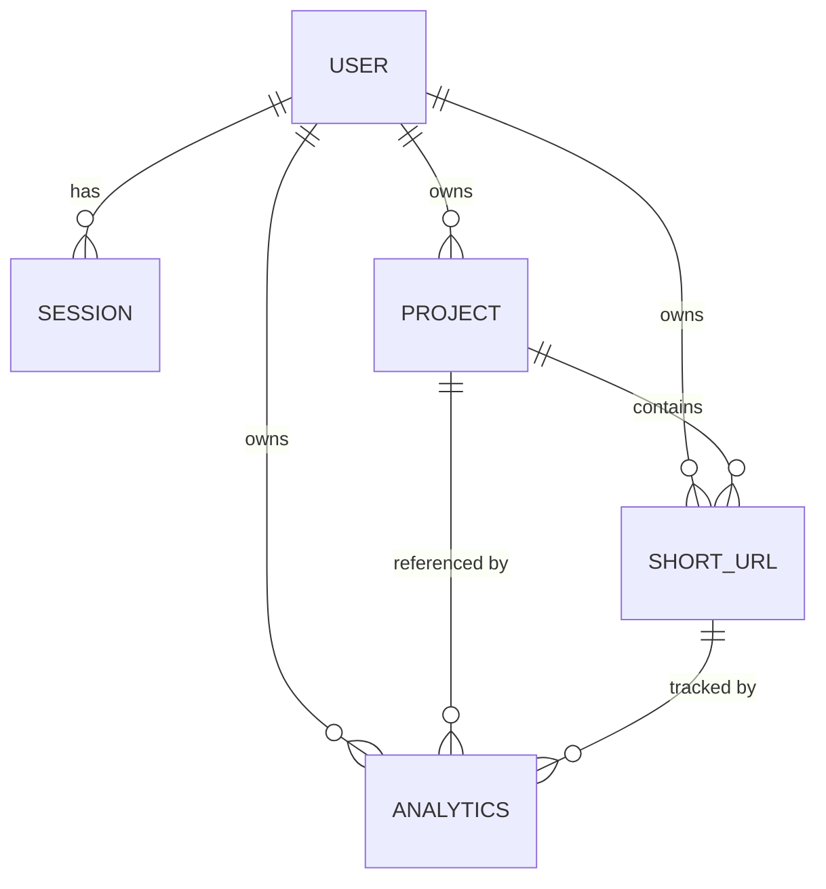

# SnapLink — Backend Architecture

> **Living document** — derived from the actual codebase, not a template.
> Last updated: 2026-08-29.

---

## Table of Contents

1. [Project Overview](#1-project-overview)
2. [Technology Stack](#2-technology-stack)
3. [Folder Structure](#3-folder-structure)
4. [Request Lifecycle](#4-request-lifecycle)
5. [Authentication Flow](#5-authentication-flow)
6. [Project Module](#6-project-module)
7. [URL Module](#7-url-module)
8. [Redirect System](#8-redirect-system)
9. [Analytics System](#9-analytics-system)
10. [Scheduling System](#10-scheduling-system)
11. [Security Features](#11-security-features)
12. [Database Models](#12-database-models)
13. [API Surface Summary](#13-api-surface-summary)
14. [Architecture Decisions](#14-architecture-decisions)
15. [Future Refactoring Notes](#15-future-refactoring-notes)
16. [Developer Onboarding](#16-developer-onboarding)

---

## 1. Project Overview

### What SnapLink Backend Does

SnapLink is a URL shortening service. The backend is a RESTful API that provides:

- **URL shortening** with custom aliases, password protection, and scheduling
- **Project-based organization** of shortened URLs
- **Click analytics** with browser, OS, device, referrer, and language breakdowns
- **User authentication** with local credentials and Google OAuth
- **QR code generation** for shortened links

### Main Features

| Feature | Description |
|---|---|
| **Shortened URLs** | Generate short codes (random or custom alias), resolve them via 302 redirects |
| **Projects** | Group URLs into named projects with soft-delete/restore cascading |
| **Analytics** | Per-day aggregation of clicks, QR scans, browsers, OS, devices, referrers, languages |
| **Authentication** | Local registration with email verification, Google OAuth, JWT access/refresh with rotation |
| **Password-Protected Links** | Private links requiring a bcrypt-hashed password to unlock |
| **Scheduling** | `scheduledLiveAt` / `scheduledDeleteAt` with a background cron worker |
| **QR Codes** | On-demand PNG QR code generation tagged with a source marker for analytics |

### High-Level Architecture

```
┌─────────────┐     ┌──────────────┐     ┌──────────────┐     ┌──────────┐
│   Client     │────▶│  Express App │────▶│   Services   │────▶│  MongoDB │
│  (Frontend)  │◀────│  (Routes +   │◀────│  (Business   │◀────│ (Mongoose│
│              │     │  Controllers)│     │   Logic)     │     │  Models) │
└─────────────┘     └──────────────┘     └──────────────┘     └──────────┘
                           │                    │
                           │                    ├──▶ Nodemailer (SMTP)
                           │                    ├──▶ Google OAuth
                           │                    ├──▶ QR Code library
                           │                    └──▶ node-cron (scheduler)
                           │
                    ┌──────────────┐
                    │  Middleware   │
                    │  (auth, rate │
                    │  limit, CSRF,│
                    │  validation) │
                    └──────────────┘
```

---

## 2. Technology Stack

| Category | Technology | Version Requirement | Purpose |
|---|---|---|---|
| **Runtime** | Node.js | ≥ 18.0.0 | ES Modules, native crypto |
| **Framework** | Express.js | — | HTTP routing, middleware pipeline |
| **Database** | MongoDB + Mongoose | — | Document store and ODM |
| **Authentication** | `jsonwebtoken` | — | Access, refresh, verification, and reset tokens |
| **Password Hashing** | `bcrypt` | — | 12-round bcrypt for user and link passwords |
| **Email** | `nodemailer` | — | Verification and password-reset emails via SMTP |
| **Google OAuth** | `google-auth-library` | — | ID token verification for Google sign-in |
| **QR Generation** | `qrcode` | — | On-demand PNG QR codes |
| **Scheduling** | `node-cron` | — | Per-minute cron for URL activation/deletion |
| **Validation** | `express-validator` | — | Request body/params/query validation chains |
| **Security** | `helmet` | — | HTTP security headers |
| **Security** | `cors` | — | Cross-origin request policy |
| **Security** | `express-rate-limit` | — | Per-endpoint rate limiting |
| **Security** | `cookie-parser` | — | HTTP-only cookie parsing |
| **Logging** | `morgan` | — | HTTP request logging (development only) |
| **Configuration** | `dotenv` | — | Environment variable loading |

---

## 3. Folder Structure

```
backend/src/
├── app.js                 # Express application assembly (middleware + routes)
├── server.js              # Entry point: DB connection, scheduler start, HTTP listen, shutdown
│
├── config/                # Environment and database configuration
│   ├── env.js             # Centralized config object; fails fast on missing required vars
│   └── db.js              # Mongoose connection with fatal-on-failure semantics
│
├── constants/             # Frozen enum objects shared across the application
│   ├── accountStatus.js   # ACTIVE, SUSPENDED
│   ├── analytics.js       # BROWSER, OS, DEVICE_TYPE, VISIT_SOURCE, report limits
│   ├── authProvider.js    # LOCAL, GOOGLE
│   ├── role.js            # USER, ADMIN
│   ├── shortCode.js       # Alphabet, length, reserved codes, alias constraints
│   ├── status.js          # URL_STATUS: ACTIVE, INACTIVE, DELETED_LINK, DELETED_PROJECT
│   ├── tokenType.js       # ACCESS, REFRESH, EMAIL_VERIFICATION, PASSWORD_RESET
│   └── visibility.js      # PUBLIC, PRIVATE
│
├── controllers/           # Thin HTTP handlers — transport concerns only
│   ├── analytics.controller.js   # 7 report endpoints (all pass-through)
│   ├── auth.controller.js        # 13 auth endpoints (cookie handling + delegation)
│   ├── health.controller.js      # Liveness probe
│   ├── project.controller.js     # 6 CRUD endpoints (all pass-through)
│   ├── redirect.controller.js    # 2 public redirect endpoints (302 + cache headers)
│   └── url.controller.js         # 8 URL management endpoints
│
├── middleware/            # Express middleware pipeline components
│   ├── auth.middleware.js            # JWT access-token guard (populates req.user)
│   ├── error.middleware.js           # Global error handler → standardized JSON
│   ├── notFound.middleware.js        # 404 catch-all for unmatched routes
│   ├── originValidation.middleware.js # CSRF protection via Origin/Referer checking
│   ├── rateLimit.middleware.js       # Per-endpoint rate limiters (7 instances)
│   └── validate.middleware.js        # express-validator result collector → 422
│
├── models/                # Mongoose schemas and indexes
│   ├── analytics.model.js   # One document per link per UTC day
│   ├── project.model.js     # URL container with soft-delete and title uniqueness
│   ├── session.model.js     # Refresh-token session (hashed token + metadata)
│   ├── shortUrl.model.js    # Shortened URL with status, scheduling, password
│   └── user.model.js        # User account with verification, TTL cleanup
│
├── routes/                # Express routers — wiring only
│   ├── index.js              # Composes /health, /auth, /projects, /urls, /analytics
│   ├── analytics.routes.js   # /api/v1/analytics/:urlId/*
│   ├── auth.routes.js        # /api/v1/auth/*
│   ├── health.routes.js      # /api/v1/health
│   ├── project.routes.js     # /api/v1/projects/*
│   ├── redirect.routes.js    # /:shortCode (mounted at application root)
│   └── url.routes.js         # /api/v1/urls/*
│
├── services/              # Business logic and integrations
│   ├── analytics.service.js      # Visit recording, aggregation, reporting
│   ├── auth.service.js           # Registration, login, OAuth, password flows
│   ├── email.service.js          # SMTP delivery (verification + reset emails)
│   ├── google.service.js         # Google ID token verification
│   ├── project.service.js        # Project CRUD with transactional cascading
│   ├── qr.service.js             # QR code PNG generation
│   ├── redirect.service.js       # Short code resolution and access gates
│   ├── session.service.js        # Session persistence (create, rotate, revoke)
│   ├── token.service.js          # JWT signing and verification for all token types
│   ├── url.service.js            # URL lifecycle (create, update, delete, restore)
│   └── urlScheduler.service.js   # Background cron for scheduled activation/deletion
│
├── utils/                 # Stateless helpers and shared abstractions
│   ├── ApiError.js           # HTTP-aware Error subclass with status code
│   ├── ApiResponse.js        # sendSuccess / sendError response envelope helpers
│   ├── asyncHandler.js       # Wraps async handlers to forward rejections to next()
│   ├── cookie.js             # setAuthCookies / clearAuthCookies with shared flags
│   ├── countKey.js           # MongoDB map-key encoding (escapes dots and dollars)
│   ├── crypto.js             # SHA-256 hashing and constant-time comparison
│   ├── password.js           # bcrypt hash/compare wrappers
│   ├── sanitizeShortUrl.js   # Strips password hash before response
│   ├── sanitizeUser.js       # Strips sensitive fields before response
│   ├── shortCode.js          # Cryptographic random short-code generation
│   └── userAgent.js          # User-Agent → browser/OS/device classification
│
└── validators/            # express-validator chain definitions
    ├── analytics.validator.js   # Report query validation (urlId, from, to)
    ├── auth.validator.js        # Auth endpoint validators (register, login, etc.)
    ├── project.validator.js     # Project CRUD validators
    └── url.validator.js         # URL CRUD + alias + unlock validators
```

### Folder Responsibilities

| Folder | Why It Exists | What Belongs There |
|---|---|---|
| `config/` | Isolates environment access and database setup so they can be imported without side effects | Config objects, connection modules |
| `constants/` | Provides a single source of truth for all enum values used across services and models | Frozen objects (`Object.freeze`), no logic |
| `controllers/` | Separates HTTP transport concerns (req/res, cookies, headers) from business logic | Request destructuring, service calls, response formatting |
| `middleware/` | Reusable pipeline stages that apply across routes | Auth guards, validation, rate limiting, error handling |
| `models/` | Defines the database schema as the persistence contract | Mongoose schemas, indexes, no business logic |
| `routes/` | Declares the API surface and wires middleware chains | Router definitions only — no logic |
| `services/` | Owns all business rules, domain orchestration, and external integrations | Business logic, infrastructure wrappers, data access |
| `utils/` | Shared, stateless, domain-agnostic functions | Hashing, encoding, sanitization, error classes |
| `validators/` | Defines input validation rules separate from business rules | `express-validator` chains |

---

## 4. Request Lifecycle

Every request follows the same pipeline:

```
                           ┌─────────────────────────────┐
                           │         Incoming Request     │
                           └──────────────┬──────────────┘
                                          ▼
                           ┌─────────────────────────────┐
                           │   Global Middleware (app.js) │
                           │   helmet → cors → json →    │
                           │   cookieParser → origin      │
                           │   validation                 │
                           └──────────────┬──────────────┘
                                          ▼
                           ┌─────────────────────────────┐
                           │     Route Matching           │
                           │  /api/v1/* → apiRoutes       │
                           │  /:shortCode → redirectRoutes│
                           └──────────────┬──────────────┘
                                          ▼
                           ┌─────────────────────────────┐
                           │   Route-Level Middleware     │
                           │   rateLimit → authMiddleware │
                           │   → validator chains →       │
                           │   validateMiddleware          │
                           └──────────────┬──────────────┘
                                          ▼
                           ┌─────────────────────────────┐
                           │        Controller            │
                           │  Reads req → delegates to    │
                           │  service → formats response  │
                           └──────────────┬──────────────┘
                                          ▼
                           ┌─────────────────────────────┐
                           │         Service              │
                           │  Business rules → model      │
                           │  queries → cross-service     │
                           │  orchestration               │
                           └──────────────┬──────────────┘
                                          ▼
                           ┌─────────────────────────────┐
                           │     Model (Mongoose)         │
                           │  Schema validation →         │
                           │  MongoDB operations          │
                           └──────────────┬──────────────┘
                                          ▼
                           ┌─────────────────────────────┐
                           │        Response              │
                           │  sendSuccess() or throw      │
                           │  ApiError → errorMiddleware   │
                           └─────────────────────────────┘
```

### Concrete Example: `POST /api/v1/urls`

1. **Global middleware** (`app.js`): `helmet()` → `cors()` → `express.json()` → `cookieParser()` → `originValidationMiddleware` (validates Origin header for CSRF)
2. **Route match** (`routes/index.js`): `/api/v1/urls` → `urlRoutes`
3. **Route-level middleware** (`url.routes.js`): `authMiddleware` → `createUrlValidator` → `validateMiddleware`
4. **Controller** (`url.controller.js` → `createUrl`): Destructures `req.body`, calls `urlService.createUrl(...)`, returns `sendSuccess(res, { statusCode: 201, data: { shortUrl } })`
5. **Service** (`url.service.js` → `createUrl`): Validates project ownership → checks alias availability → hashes password → opens transaction → claims project → creates ShortUrl document → returns with `clickCount: 0`
6. **Model** (`shortUrl.model.js`): Mongoose validates schema, unique indexes enforce short-code and title uniqueness
7. **Response**: `{ success: true, message: "Short URL created successfully", data: { shortUrl: {...} } }`

### Error Path

Any `throw new ApiError(...)` or unhandled rejection is caught by `asyncHandler` and forwarded to the global `errorMiddleware` (`error.middleware.js`), which produces:

```json
{ "success": false, "message": "...", "errors": [] }
```

---

## 5. Authentication Flow

### Files Involved

| Layer | Files |
|---|---|
| **Routes** | `routes/auth.routes.js` |
| **Controller** | `controllers/auth.controller.js` |
| **Service** | `services/auth.service.js` |
| **Supporting Services** | `services/token.service.js`, `services/session.service.js`, `services/email.service.js`, `services/google.service.js` |
| **Middleware** | `middleware/auth.middleware.js` |
| **Utils** | `utils/cookie.js`, `utils/password.js`, `utils/crypto.js`, `utils/sanitizeUser.js` |
| **Model** | `models/user.model.js`, `models/session.model.js` |
| **Validators** | `validators/auth.validator.js` |

### 5.1 Registration

```
POST /api/v1/auth/register
    │
    ├── registerLimiter (5 req/IP/hour)
    ├── registerValidator (fullName, email, password)
    ├── validateMiddleware
    │
    ▼
auth.controller.register
    │
    ▼
auth.service.register
    ├── Check email uniqueness (User.findOne)
    ├── Hash password (bcrypt, 12 rounds)
    ├── Create user with:
    │   ├── authProvider: LOCAL
    │   ├── isEmailVerified: false
    │   ├── unverifiedExpiresAt: now + 1 hour (TTL auto-delete)
    │   └── verificationEmailLastSentAt: now
    ├── Generate email verification JWT (token.service)
    └── Send verification email (email.service)
```

**Key design**: Unverified accounts are automatically deleted by MongoDB's TTL index after 1 hour if the user never verifies.

### 5.2 Email Verification

```
POST /api/v1/auth/verify-email   { token }
    │
    ▼
auth.service.verifyEmail
    ├── Verify JWT signature and expiry (token.service)
    ├── Load user by ID from token payload
    ├── Check token version (ver claim) matches user.emailVerificationVersion
    │   └── Mismatch → "link no longer valid" (newer email was issued)
    ├── If not yet verified:
    │   ├── Set isEmailVerified = true
    │   ├── Clear unverifiedExpiresAt (prevents TTL deletion)
    │   └── Clear verificationEmailLastSentAt
    └── Idempotent: re-verifying an already-verified account is a no-op
```

**Key design**: The `emailVerificationVersion` counter invalidates all previous tokens when a new verification email is requested, without needing a blacklist.

### 5.3 Resend Verification Email

```
POST /api/v1/auth/resend-verification-email   { email }
    │
    ▼
auth.service.resendVerificationEmail
    ├── Find user by email
    ├── If not found or already verified → silent success (prevents email enumeration)
    ├── Enforce 1-minute cooldown (verificationEmailLastSentAt)
    ├── Increment emailVerificationVersion (invalidates old tokens)
    ├── Update verificationEmailLastSentAt
    └── Send new verification email
```

### 5.4 Login

```
POST /api/v1/auth/login   { email, password }
    │
    ├── loginLimiter (10 req/IP/15 min)
    │
    ▼
auth.controller.login
    │
    ▼
auth.service.login
    ├── Find user with password selected (+password)
    ├── Compare password (bcrypt)
    ├── Check isEmailVerified
    ├── Check accountStatus ≠ SUSPENDED
    ├── issueAuthTokens:
    │   ├── Generate ObjectId for session
    │   ├── Generate access JWT (15 min, sub + role + type)
    │   ├── Generate refresh JWT (7 days, sub + sid + type)
    │   └── Create Session document (hashed refresh token)
    └── Return { user, accessToken, refreshToken }
    │
    ▼
auth.controller.login
    ├── setAuthCookies(res, { accessToken, refreshToken })
    │   ├── accessToken → httpOnly, path: /
    │   └── refreshToken → httpOnly, path: /api/v1/auth
    └── sendSuccess(res, { user: sanitizeUser(user) })
```

### 5.5 Refresh Token Rotation

```
POST /api/v1/auth/refresh
    │
    ▼
auth.controller.refresh
    ├── Read refreshToken from cookies
    ├── If missing → ApiError(401)
    │
    ▼
auth.service.refresh
    ├── Verify refresh JWT (token.service)
    ├── Load session by ID from token payload (sid)
    ├── Validate session owner matches token subject (sub)
    ├── Compare hashToken(refreshToken) with session.hashedRefreshToken
    │   └── Mismatch → revoke session (reuse/theft detected)
    ├── Check session.expiresAt
    ├── Load user, check accountStatus
    ├── Generate new access token
    ├── Generate new refresh token (same session ID)
    ├── Rotate session (update hash, expiry, metadata)
    └── Return { user, accessToken, refreshToken }
```

**Key design**: Refresh token rotation detects token reuse. If a stolen token is replayed after the legitimate user has already rotated, the hash mismatch triggers session revocation.

### 5.6 Logout

```
POST /api/v1/auth/logout
    │
    ▼
auth.service.logout
    ├── Decode refresh token (no verification — graceful)
    └── Delete session where _id = sid AND hashedRefreshToken matches
    │
    ▼
auth.controller.logout
    └── clearAuthCookies(res)
```

### 5.7 Forgot Password

```
POST /api/v1/auth/forgot-password   { email }
    │
    ├── forgotPasswordLimiter (5 req/email/hour)
    │
    ▼
auth.service.forgotPassword
    ├── Find user with password selected
    ├── Only local accounts with a password qualify
    ├── Generate password-reset JWT
    │   └── Secret = JWT_PASSWORD_RESET_SECRET + user.password (hash-bound)
    └── Send reset email
    │
    ▼
    Always return generic message (prevents email enumeration)
```

**Key design**: The reset token's secret includes the current password hash. Changing the password automatically invalidates the token — single-use without extra storage.

### 5.8 Reset Password

```
POST /api/v1/auth/reset-password   { token, password }
    │
    ▼
auth.service.resetPassword
    ├── Decode token to read sub (user ID)
    ├── Load user with password selected
    ├── Verify token against JWT_PASSWORD_RESET_SECRET + user.password
    │   └── Fails if password was already changed (token consumed)
    ├── Hash new password, save user
    └── Revoke all user sessions (sessionService.revokeAllUserSessions)
    │
    ▼
auth.controller.resetPassword
    └── clearAuthCookies(res)
```

### 5.9 Google OAuth

```
POST /api/v1/auth/google   { idToken }
    │
    ├── googleAuthLimiter (10 req/IP/15 min)
    │
    ▼
auth.service.googleAuth
    ├── Verify Google ID token (google.service → OAuth2Client)
    ├── Extract normalized profile (googleId, email, emailVerified, fullName, picture)
    ├── Reject if Google email not verified
    ├── Account resolution priority:
    │   1. Match by providerId (Google ID) → use existing account
    │   2. Match by email → check account type:
    │      a. Unverified local account → delete it, create Google account
    │      b. Verified account → link Google (set providerId)
    │   3. No match → create new Google account
    ├── Check accountStatus ≠ SUSPENDED
    └── issueAuthTokens → return { user, accessToken, refreshToken }
```

**Key design**: Google sign-in matches by `providerId` first (not email), so a user who changes their email on Google still reaches their SnapLink account.

---

## 6. Project Module

### Purpose

Projects are containers that group shortened URLs. Every URL must belong to a project. Deleting a project cascades to its URLs; restoring a project cascades the restore.

### Files Involved

| Layer | File |
|---|---|
| Route | `routes/project.routes.js` |
| Controller | `controllers/project.controller.js` |
| Service | `services/project.service.js` |
| Model | `models/project.model.js` |
| Validator | `validators/project.validator.js` |

### Operations

#### Create Project

```
POST /api/v1/projects   { title }
    → projectService.createProject({ ownerId, title })
    → Project.create()
    → Unique index on (owner, title) where deletedAt=null prevents duplicates
```

#### List Projects

```
GET /api/v1/projects?deleted=true|false
    → projectService.getProjects({ ownerId, deleted })
    → Query by deletedAt: null (active) or $ne: null (deleted)
    → Sorted by updatedAt descending
```

#### Get Project by ID

```
GET /api/v1/projects/:projectId
    → projectService.getProjectById({ projectId, ownerId })
    → findOwnedProject(): returns 404 (never 403) to avoid revealing other owners
```

#### Update Project

```
PATCH /api/v1/projects/:projectId   { title }
    → projectService.updateProject({ projectId, ownerId, title })
    → Load owned project → update title → save
    → Unique index violation → "title already exists"
```

#### Soft-Delete Project

```
DELETE /api/v1/projects/:projectId
    → projectService.softDeleteProject()
    │
    ▼  MongoDB transaction:
    ├── Set project.deletedAt = now
    ├── Save project
    └── ShortUrl.updateMany:
        ├── Match: project's URLs with status ACTIVE or INACTIVE
        └── Set: status → DELETED_PROJECT
```

**Key design**: Links the owner had already deleted (`DELETED_LINK`) are left untouched so their own state survives a later restore.

#### Restore Project

```
PATCH /api/v1/projects/:projectId/restore
    → projectService.restoreProject()
    │
    ▼  MongoDB transaction:
    ├── Set project.deletedAt = null
    ├── Save project (may fail if title now taken by another project)
    ├── ShortUrl.updateMany:
    │   ├── Match: DELETED_PROJECT links with scheduledLiveAt ≤ now or null
    │   └── Set: status → ACTIVE
    └── ShortUrl.updateMany:
        ├── Match: DELETED_PROJECT links with scheduledLiveAt > now
        └── Set: status → INACTIVE
```

### Ownership Model

- Every query filters by `owner: ownerId`
- A missing match returns **404** (not 403) so the API never reveals that another user owns the ID
- `claimActiveProject()` uses `findOneAndUpdate` within transactions to create a write conflict instead of interleaving with concurrent deletes

---

## 7. URL Module

### Purpose

Manages the lifecycle of shortened URLs: creation with custom or random aliases, password protection, scheduling, soft-delete, restore, QR codes, and analytics integration.

### Files Involved

| Layer | File |
|---|---|
| Route | `routes/url.routes.js` |
| Controller | `controllers/url.controller.js` |
| Service | `services/url.service.js`, `services/qr.service.js` |
| Model | `models/shortUrl.model.js` |
| Validator | `validators/url.validator.js` |
| Constants | `constants/status.js`, `constants/visibility.js`, `constants/shortCode.js` |

### 7.1 Create URL

```
POST /api/v1/urls
{
  projectId, title, originalUrl, visibility,
  customAlias, password, scheduledLiveAt, scheduledDeleteAt
}
```

**Flow:**

```
urlService.createUrl
    ├── assertProjectOwned (via projectService)
    ├── Validate password rules:
    │   ├── PRIVATE requires a non-empty password
    │   └── PUBLIC cannot have a password
    ├── Validate scheduling:
    │   ├── scheduledLiveAt must be in the future
    │   ├── scheduledDeleteAt must be in the future
    │   └── scheduledDeleteAt must be after scheduledLiveAt
    ├── Resolve short code:
    │   ├── Custom alias → check availability (not reserved, not taken)
    │   └── No alias → generateUniqueShortCode (retry up to 5 times)
    ├── Hash password (bcrypt) before opening transaction
    │
    ▼  MongoDB transaction:
    ├── claimActiveProject (write-claim to prevent interleaving with project delete)
    ├── ShortUrl.create with:
    │   ├── status: INACTIVE if scheduledLiveAt is in the future, else ACTIVE
    │   ├── isCustomAlias: true if custom alias was provided
    │   └── password: hashed (or undefined for public links)
    └── Return with clickCount: 0
```

### 7.2 Alias Handling

- **Random codes**: 7 characters from `abcdefghijkmnopqrstuvwxyzABCDEFGHJKLMNPQRSTUVWXYZ23456789` (look-alikes excluded: `0/O`, `1/l/I`)
- **Custom aliases**: 3-32 characters, `[a-zA-Z0-9_-]` only
- **Reserved codes**: `api`, `health` (would shadow API routes)
- **Collision handling**: Random codes retry up to 5 times; custom aliases fail immediately if taken
- **Generated via**: `crypto.randomInt()` (cryptographic random source)

### 7.3 Password-Protected URLs

```
Visibility: PRIVATE + password set
    │
    ├── Password hashed with bcrypt before storage
    ├── Password field is select:false in schema
    ├── Changing to PUBLIC automatically clears the password
    ├── Changing to PRIVATE without a password is rejected
    └── Redirect controller checks password via redirect.service → comparePassword
```

### 7.4 Soft-Delete and Restore

**Soft-delete:**
```
DELETE /api/v1/urls/:urlId
    → Set deletedAt = now, status = DELETED_LINK
    → Link stops resolving (redirect service checks status === ACTIVE)
```

**Restore:**
```
PATCH /api/v1/urls/:urlId/restore
    │
    ▼  MongoDB transaction:
    ├── claimActiveProject (ensures parent project is live)
    │   └── If project is deleted → 409 with project summary for client
    ├── ShortUrl.updateOne: status → ACTIVE or INACTIVE (based on scheduledLiveAt)
    └── Return { shortUrl, project }
```

### 7.5 QR Code Generation

```
GET /api/v1/urls/:urlId/qr
    │
    ▼
url.controller.getUrlQrCode
    ├── urlService.getOwnedShortCode({ urlId, ownerId })
    ├── qrService.generateQrPng(shortCode)
    │   └── QR encodes: {APP_URL}/{shortCode}?src=qr
    │       └── src=qr marker → analytics counts it as a QR scan
    ├── res.type('png')
    └── res.send(imageBuffer)
```

### 7.6 Scheduling

- `scheduledLiveAt`: URL starts as `INACTIVE`, activated by the background scheduler when the time arrives
- `scheduledDeleteAt`: URL is soft-deleted by the background scheduler when the time arrives
- See [Section 10: Scheduling System](#10-scheduling-system) for the scheduler implementation

### 7.7 Analytics Reset

```
PATCH /api/v1/urls/:urlId   { resetAnalytics: true }
    → After successful URL update save:
    → analyticsService.deleteAnalyticsByUrl(shortUrl._id)
    → Analytics.deleteMany({ url: urlId })
    → Future visits create new daily documents as normal
```

### URL Status State Machine

```
                    ┌──────────────────┐
     Create with    │                  │     scheduledLiveAt
     future live ──▶│    INACTIVE      │──── arrives ────┐
                    │                  │                  │
                    └──────────────────┘                  │
                                                         ▼
                    ┌──────────────────┐         ┌──────────────────┐
   scheduledDeleteAt│                  │  Create │                  │
   arrives ─────────│  DELETED_LINK    │◀────────│     ACTIVE       │
                    │                  │  Owner  │                  │
     Owner delete ─▶│                  │ delete  │                  │
                    └────────┬─────────┘         └────────┬─────────┘
                             │                            │
                    Owner    │                   Project   │
                    restore  │                   deleted   │
                             ▼                            ▼
                    ┌──────────────────┐         ┌──────────────────┐
                    │ ACTIVE/INACTIVE  │         │ DELETED_PROJECT  │
                    │ (based on        │         │ (restored when   │
                    │  scheduledLiveAt)│         │  project restored│
                    └──────────────────┘         └──────────────────┘
```

---

## 8. Redirect System

### Purpose

Resolves a short code to its original URL and redirects the visitor, while recording the visit for analytics.

### Files Involved

| Layer | File |
|---|---|
| Route | `routes/redirect.routes.js` (mounted at application root, **after** API routes) |
| Controller | `controllers/redirect.controller.js` |
| Service | `services/redirect.service.js` |
| Model | `models/shortUrl.model.js`, `models/analytics.model.js` |

### Flow: `GET /:shortCode`

```
GET /:shortCode?src=qr
    │
    ▼
redirect.controller.redirectToOriginalUrl
    ├── Collect visit context:
    │   ├── source: req.query.src (e.g. "qr")
    │   ├── userAgent: req.headers['user-agent']
    │   ├── referrer: req.headers.referer
    │   └── language: req.headers['accept-language']
    │
    ▼
redirect.service.resolveShortLink({ shortCode, visit })
    ├── ShortUrl.findOne({ shortCode }).select('+password')
    ├── Status gate:
    │   └── Only status === ACTIVE resolves (all others → 404)
    │       └── DELETED_PROJECT links return 404 without project lookup
    ├── Password gate (if visibility === PRIVATE && password exists):
    │   ├── No password supplied → 401 "password protected"
    │   └── Wrong password → 401 "incorrect password"
    ├── Update lastAccessedAt (fire-and-forget updateOne)
    ├── Record visit (analytics):
    │   └── Failure is logged and swallowed — never blocks the redirect
    └── Return originalUrl
    │
    ▼
redirect.controller.redirectToOriginalUrl
    ├── Set Cache-Control: no-cache, no-store, must-revalidate, private
    ├── Set Pragma: no-cache
    ├── Set Expires: 0
    └── res.redirect(302, originalUrl)
```

### Flow: `POST /:shortCode` (Unlock Password-Protected Link)

```
POST /:shortCode   { password }
    │
    ├── unlockShortLinkLimiter (10 attempts/IP/15 min)
    ├── unlockShortLinkValidator
    │
    ▼
redirect.service.resolveShortLink({ shortCode, password, visit })
    └── Same flow as GET, but password is now supplied
    │
    ▼
redirect.controller.unlockShortLink
    └── sendSuccess(res, { data: { originalUrl } })
```

### Cache-Control Fix

Without the explicit anti-caching headers, browsers cache 302 redirects. Subsequent visits would be resolved from the browser cache instead of hitting the backend, causing:

- Analytics under-counting (visits not recorded)
- Stale redirects (if the original URL changes)
- Password-protected links bypassed (cached redirect skips the password gate)

The headers `Cache-Control: no-cache, no-store, must-revalidate, private` + `Pragma: no-cache` + `Expires: 0` ensure every visit hits the backend and is counted.

---

## 9. Analytics System

### Purpose

Tracks and reports how often each link is used, with breakdowns by browser, operating system, device type, referrer, and language.

### Files Involved

| Layer | File |
|---|---|
| Route | `routes/analytics.routes.js` |
| Controller | `controllers/analytics.controller.js` |
| Service | `services/analytics.service.js` |
| Model | `models/analytics.model.js` |
| Utils | `utils/userAgent.js`, `utils/countKey.js` |
| Constants | `constants/analytics.js` |

### Analytics Schema

Each document covers **one link** for **one UTC calendar day**:

```
Analytics {
    url:              ObjectId → ShortUrl
    project:          ObjectId → Project
    owner:            ObjectId → User
    date:             Date (truncated to UTC midnight)
    clicks:           Number (non-QR visits)
    qrScans:          Number (visits with ?src=qr)
    browserCounts:    Map<String, Number>  (e.g. { "chrome": 42, "firefox": 7 })
    osCounts:         Map<String, Number>
    deviceCounts:     Map<String, Number>
    referrerCounts:   Map<String, Number>  (hostname only, e.g. "google.com")
    languageCounts:   Map<String, Number>  (e.g. "en-us")
}
```

**Unique index**: `{ url, date }` — one document per link per day.

### Daily Aggregation Strategy

No per-click history is stored. Each visit is folded into the day's document via an atomic `$inc` upsert:

```javascript
Analytics.updateOne(
    { url: shortUrl._id, date: startOfUtcDay() },         // filter
    {
        $inc: {
            [visitCounter]: 1,                              // clicks or qrScans
            [`browserCounts.${encodeCountKey(browser)}`]: 1,
            [`osCounts.${encodeCountKey(os)}`]: 1,
            [`deviceCounts.${encodeCountKey(device)}`]: 1,
            [`referrerCounts.${encodeCountKey(referrer)}`]: 1,
            [`languageCounts.${encodeCountKey(language)}`]: 1,
        },
        $setOnInsert: { project: ..., owner: ... },
    },
    { upsert: true }
);
```

**Concurrent visit handling**: Two visits that race to create the same day's document will trigger a duplicate key error (`11000`). The loser retries the `updateOne` and folds into the document the winner created.

### Browser/OS/Device Detection

Implemented in `utils/userAgent.js`. The raw `User-Agent` header is classified into buckets:

| Category | Buckets |
|---|---|
| **Browser** | Chrome, Edge, Firefox, Safari, Opera, Unknown |
| **OS** | Windows, macOS, Linux, Android, iOS, Unknown |
| **Device** | Desktop, Mobile, Tablet, Unknown |

Detection order matters: Edge and Opera advertise Chrome, Chrome advertises Safari, Android reports Linux. The classifier checks in the correct precedence order.

### Referrer Tracking

The full referrer URL is reduced to its hostname (e.g. `https://www.google.com/search?q=...` → `google.com`). Missing or unparseable referrers become `"direct"`. This keeps the key space small and avoids storing private paths.

### Language Tracking

The preferred tag is extracted from the `Accept-Language` header (first value before the comma, without quality parameters). Missing values become `"unknown"`.

### Map Key Encoding

MongoDB map keys cannot contain `.` (dot notation) or start with `$` (operator). Since referrer hostnames commonly contain dots (e.g. `google.com`), all map keys are encoded via `utils/countKey.js`:

- `.` → `%2E`
- `$` → `%24`
- `%` → `%25` (escaped first, unescaped last for round-trip safety)

Keys are also truncated to 100 characters to prevent a hostile header from growing a document without limit.

### Reporting Endpoints

All 7 analytics endpoints follow the same pattern:

1. Resolve reporting window (`from`/`to` query params, default: last 30 days, max: 366 days)
2. Verify URL ownership (`assertUrlOwned` — separate from URL service to avoid circular dependency)
3. Load daily documents in range
4. Aggregate and return

| Endpoint | Returns |
|---|---|
| `GET /:urlId` | All reports in one payload |
| `GET /:urlId/overview` | clicks, qrScans, totalVisits, daysWithVisits, firstVisitOn, lastVisitOn |
| `GET /:urlId/timeline` | Day-by-day series (date, clicks, qrScans, totalVisits) |
| `GET /:urlId/browsers` | Sorted browser counts |
| `GET /:urlId/os` | Sorted OS counts |
| `GET /:urlId/devices` | Sorted device counts |
| `GET /:urlId/referrers` | Sorted referrer counts |

### Lifetime Totals

The URL module calls `analyticsService.getLifetimeTotals()` to attach a `clickCount` to every link response. This runs a MongoDB aggregation pipeline across all days:

```javascript
Analytics.aggregate([
    { $match: { url: { $in: urlIds } } },
    { $group: { _id: '$url', clicks: { $sum: '$clicks' }, qrScans: { $sum: '$qrScans' } } }
]);
```

Visit totals are **not** stored on the ShortUrl document — analytics is the single source of truth.

### Analytics Reset

When a URL update includes `resetAnalytics: true`:
- `Analytics.deleteMany({ url: urlId })` removes all daily documents
- Future visits create new daily documents as normal
- The link's `clickCount` drops to zero immediately

---

## 10. Scheduling System

### Purpose

Automates URL lifecycle transitions based on user-configured timestamps.

### Files Involved

| File | Role |
|---|---|
| `services/urlScheduler.service.js` | Background worker (cron + transition logic) |
| `models/shortUrl.model.js` | `scheduledLiveAt`, `scheduledDeleteAt` fields |
| `server.js` | Starts/stops the scheduler on application lifecycle |
| `constants/status.js` | Status enum used in transitions |

### Scheduling Fields

| Field | Purpose | Set By |
|---|---|---|
| `scheduledLiveAt` | When an INACTIVE URL should become ACTIVE | User at creation or update |
| `scheduledDeleteAt` | When an ACTIVE/INACTIVE URL should be soft-deleted | User at creation or update |

### Scheduler Execution

The scheduler runs as a `node-cron` job every minute (`* * * * *`):

```
server.js → startScheduler()
    │
    ▼
urlScheduler.service.js
    ├── cron.schedule('* * * * *', runSchedulingCycle)
    │
    ▼ runSchedulingCycle (every 60 seconds):
    ├── processScheduledActivations(now)
    │   └── ShortUrl.updateMany({
    │         scheduledLiveAt: { $ne: null, $lte: now },
    │         status: INACTIVE
    │       }, { $set: { status: ACTIVE } })
    │
    └── processScheduledDeletions(now)
        └── ShortUrl.updateMany({
              scheduledDeleteAt: { $ne: null, $lte: now },
              status: { $in: [ACTIVE, INACTIVE] }
            }, { $set: { status: DELETED_LINK, deletedAt: now } })
```

### Lifecycle Integration

- **Application start** (`server.js`): `startScheduler()` called after database connection
- **Graceful shutdown** (`server.js`): `stopScheduler()` called on SIGINT/SIGTERM before `server.close()`
- **Idempotent**: The `status` filter ensures each operation only transitions qualifying URLs

---

## 11. Security Features

### 11.1 JWT Authentication

| Token Type | Secret | TTL | Purpose |
|---|---|---|---|
| Access | `JWT_ACCESS_SECRET` | 15 min | Authenticates API requests (sent as HTTP-only cookie) |
| Refresh | `JWT_REFRESH_SECRET` | 7 days | Issues new access tokens (sent as HTTP-only cookie scoped to `/api/v1/auth`) |
| Email Verification | `JWT_EMAIL_VERIFICATION_SECRET` | 15 min | Email verification link |
| Password Reset | `JWT_PASSWORD_RESET_SECRET` + password hash | 15 min | Password reset link (single-use via hash binding) |

Each token carries a `type` claim (`token.service.js`). Verification rejects tokens whose type does not match the expected flow.

**Implemented in**: `services/token.service.js`

### 11.2 Refresh Token Rotation

On every `/auth/refresh` call:
1. Old refresh token is verified and compared against the stored hash
2. New refresh token is generated and stored (old hash overwritten)
3. If the old token's hash doesn't match (reuse detected), the entire session is revoked

**Implemented in**: `services/auth.service.js` → `refresh()`, `services/session.service.js` → `rotateSession()`

### 11.3 Email Verification

- Required before local login
- Unverified accounts auto-deleted after 1 hour (MongoDB TTL index on `unverifiedExpiresAt`)
- Version-based invalidation: resending bumps `emailVerificationVersion`, invalidating all older tokens
- 1-minute cooldown between resend requests

**Implemented in**: `services/auth.service.js`, `models/user.model.js` (TTL index)

### 11.4 Password Hashing

- User passwords: `bcrypt` with 12 rounds (`utils/password.js`)
- Link passwords: Same bcrypt hashing (`url.service.js`)
- Refresh tokens: SHA-256 hash for storage (`utils/crypto.js`) — appropriate because tokens are high-entropy secrets
- IP addresses: SHA-256 hash for session metadata (`session.service.js`)

### 11.5 Ownership Validation

Every query that accesses user data filters by `owner: req.user._id`. No controller or service ever returns data belonging to another user. Unauthorized access returns **404** (not 403) to prevent ID enumeration.

**Implemented in**: Every service (`findOwnedUrl`, `findOwnedProject`, `assertUrlOwned`)

### 11.6 Validation Middleware

All request input is validated by `express-validator` chains before reaching controllers. Failed validation short-circuits with HTTP 422.

**Implemented in**: `validators/*.js` → `middleware/validate.middleware.js`

### 11.7 Rate Limiting

| Limiter | Window | Max | Key |
|---|---|---|---|
| `registerLimiter` | 1 hour | 5 | IP |
| `loginLimiter` | 15 min | 10 | IP |
| `resendVerificationEmailLimiter` | 1 hour | 3 | Email or IP |
| `forgotPasswordLimiter` | 1 hour | 5 | Email or IP |
| `resetPasswordLimiter` | 1 hour | 10 | IP |
| `googleAuthLimiter` | 15 min | 10 | IP |
| `unlockShortLinkLimiter` | 15 min | 10 | IP |

**Implemented in**: `middleware/rateLimit.middleware.js`

### 11.8 Helmet

Sets secure HTTP headers (X-Content-Type-Options, X-Frame-Options, CSP, etc.) on all responses.

**Implemented in**: `app.js` → `app.use(helmet())`

### 11.9 CORS

Configured with `credentials: true` and an explicit origin (not `*`). The origin falls back to `CLIENT_URL`.

**Implemented in**: `app.js` → `cors({ origin: config.corsOrigin, credentials: true })`

### 11.10 Origin Validation (CSRF Protection)

For state-changing requests (POST, PATCH, PUT, DELETE):
1. If `Origin` or `Referer` header is present, validate it against `CLIENT_URL` and `CORS_ORIGIN`
2. If neither header is present, the request is from a non-browser client (Postman, curl, server-to-server) and is allowed
3. If the origin doesn't match → 403 "CSRF forbidden"

This works because browsers unconditionally attach `Origin` on cross-origin mutation requests and cannot suppress or spoof it from client-side script.

**Implemented in**: `middleware/originValidation.middleware.js`

### 11.11 Secure Cookies

| Flag | Value | Purpose |
|---|---|---|
| `httpOnly` | `true` | Prevents JavaScript access |
| `secure` | `true` in production | Cookies only sent over HTTPS |
| `sameSite` | `none` in production, `lax` in dev | Cross-site cookies for separate frontend/backend domains |
| `domain` | Configurable | Cookie scope |
| `path` | `/` (access), `/api/v1/auth` (refresh) | Refresh cookie not sent on every request |

**Implemented in**: `utils/cookie.js`

---

## 12. Database Models

### Entity Relationship Diagram



### 12.1 User

**File**: `models/user.model.js`

| Field | Type | Notes |
|---|---|---|
| `fullName` | String | Required, max 100 chars |
| `email` | String | Unique, lowercase, validated regex |
| `password` | String | `select: false`, optional (OAuth users) |
| `authProvider` | Enum | `local` or `google` |
| `providerId` | String | Google sub ID, unique partial index |
| `profilePicture` | String | From Google profile |
| `isEmailVerified` | Boolean | Required before local login |
| `accountStatus` | Enum | `active` or `suspended` |
| `role` | Enum | `user` or `admin` |
| `unverifiedExpiresAt` | Date | TTL index: auto-deletes unverified accounts after 1 hour |
| `emailVerificationVersion` | Number | Monotonic counter for token invalidation |
| `verificationEmailLastSentAt` | Date | Cooldown enforcement |

**Indexes**: `{ email: 1 }` (unique), `{ providerId: 1 }` (unique, partial), `{ unverifiedExpiresAt: 1 }` (TTL, partial)

### 12.2 Session

**File**: `models/session.model.js`

| Field | Type | Notes |
|---|---|---|
| `user` | ObjectId → User | Indexed |
| `hashedRefreshToken` | String | SHA-256 of the refresh JWT |
| `expiresAt` | Date | Absolute session expiry |
| `userAgent` | String | Client user-agent string |
| `hashedIpAddress` | String | SHA-256 of the client IP |

Multiple sessions per user are supported (concurrent devices).

### 12.3 Project

**File**: `models/project.model.js`

| Field | Type | Notes |
|---|---|---|
| `owner` | ObjectId → User | |
| `title` | String | Required, max 100 chars |
| `deletedAt` | Date | `null` while active, set on soft-delete |

**Indexes**:
- `{ owner: 1, updatedAt: -1 }` (partial: `deletedAt: null`) — dashboard listing
- `{ owner: 1, title: 1 }` (unique, partial: `deletedAt: null`) — title uniqueness per owner while active

### 12.4 ShortUrl

**File**: `models/shortUrl.model.js`

| Field | Type | Notes |
|---|---|---|
| `project` | ObjectId → Project | Required |
| `owner` | ObjectId → User | Required |
| `title` | String | Required, max 150 chars |
| `originalUrl` | String | Required, validated `http(s)://`, max 2048 chars |
| `shortCode` | String | Globally unique, `[a-zA-Z0-9_-]`, max 32 chars |
| `isCustomAlias` | Boolean | Whether the code was user-chosen |
| `visibility` | Enum | `public` or `private` |
| `password` | String | `select: false`, bcrypt hash, only for private links |
| `status` | Enum | `active`, `inactive`, `deleted_link`, `deleted_project` |
| `scheduledLiveAt` | Date | When to activate |
| `scheduledDeleteAt` | Date | When to soft-delete |
| `deletedAt` | Date | When soft-deleted |
| `lastAccessedAt` | Date | Updated on each redirect |

**Indexes**:
- `{ shortCode: 1 }` (unique) — globally unique short codes
- `{ owner: 1, status: 1, updatedAt: -1 }` — dashboard and recycle bin listings
- `{ project: 1, status: 1, updatedAt: -1 }` — per-project listings and cascade operations
- `{ project: 1, title: 1 }` (unique, partial: status in `[active, inactive]`) — title uniqueness per project while active

### 12.5 Analytics

**File**: `models/analytics.model.js`

| Field | Type | Notes |
|---|---|---|
| `url` | ObjectId → ShortUrl | Required |
| `project` | ObjectId → Project | Required |
| `owner` | ObjectId → User | Required |
| `date` | Date | UTC midnight, required |
| `clicks` | Number | Non-QR visits, min 0 |
| `qrScans` | Number | QR visits, min 0 |
| `browserCounts` | Map\<String, Number\> | e.g. `{ "chrome": 42 }` |
| `osCounts` | Map\<String, Number\> | |
| `deviceCounts` | Map\<String, Number\> | |
| `referrerCounts` | Map\<String, Number\> | Hostname only |
| `languageCounts` | Map\<String, Number\> | Primary language tag |

**Indexes**: `{ url: 1, date: 1 }` (unique) — one document per link per day

---

## 13. API Surface Summary

All routes prefixed with `/api/v1` unless noted. Access and refresh tokens are delivered as HTTP-only cookies.

### Authentication — `/api/v1/auth`

| Method | Endpoint | Auth | Description |
|---|---|---|---|
| POST | `/register` | No | Register local account, sends verification email |
| POST | `/verify-email` | No | Verify email with JWT token |
| POST | `/resend-verification-email` | No | Resend verification email (1-min cooldown) |
| POST | `/login` | No | Log in, sets access + refresh cookies |
| POST | `/refresh` | No | Rotate tokens using refresh cookie |
| POST | `/logout` | No | Revoke session, clear cookies |
| POST | `/forgot-password` | No | Request password-reset email |
| POST | `/reset-password` | No | Set new password using reset token |
| POST | `/google` | No | Google OAuth sign-in/registration |
| GET | `/me` | Yes | Return authenticated user |
| PATCH | `/me` | Yes | Update user profile |
| POST | `/set-password` | Yes | Set first password (for OAuth users) |
| POST | `/change-password` | Yes | Change existing password |

### Projects — `/api/v1/projects`

| Method | Endpoint | Auth | Description |
|---|---|---|---|
| POST | `/` | Yes | Create a project |
| GET | `/` | Yes | List projects (active or deleted) |
| GET | `/:projectId` | Yes | Get single project |
| PATCH | `/:projectId` | Yes | Update project title |
| DELETE | `/:projectId` | Yes | Soft-delete project (cascades to URLs) |
| PATCH | `/:projectId/restore` | Yes | Restore project (cascades to URLs) |

### URLs — `/api/v1/urls`

| Method | Endpoint | Auth | Description |
|---|---|---|---|
| POST | `/` | Yes | Create shortened URL |
| GET | `/` | Yes | List URLs (active or deleted, optionally by project) |
| GET | `/alias-availability/:alias` | Yes | Check alias availability |
| GET | `/:urlId` | Yes | Get single URL |
| GET | `/:urlId/qr` | Yes | Download QR code PNG |
| PATCH | `/:urlId` | Yes | Update URL (alias, password, scheduling, etc.) |
| DELETE | `/:urlId` | Yes | Soft-delete URL |
| PATCH | `/:urlId/restore` | Yes | Restore URL |

### Analytics — `/api/v1/analytics`

| Method | Endpoint | Auth | Description |
|---|---|---|---|
| GET | `/:urlId` | Yes | All reports for a link |
| GET | `/:urlId/overview` | Yes | Headline totals |
| GET | `/:urlId/timeline` | Yes | Day-by-day series |
| GET | `/:urlId/browsers` | Yes | Browser breakdown |
| GET | `/:urlId/os` | Yes | OS breakdown |
| GET | `/:urlId/devices` | Yes | Device breakdown |
| GET | `/:urlId/referrers` | Yes | Referrer breakdown |

### Redirect — Application Root

| Method | Endpoint | Auth | Description |
|---|---|---|---|
| GET | `/:shortCode` | No | Resolve and redirect (302) |
| POST | `/:shortCode` | No | Unlock password-protected link |

### Health — `/api/v1/health`

| Method | Endpoint | Auth | Description |
|---|---|---|---|
| GET | `/` | No | Liveness probe |

### Response Envelope

All endpoints return the same JSON envelope:

```json
// Success
{ "success": true, "message": "...", "data": { ... } }

// Error
{ "success": false, "message": "...", "errors": [ { "field": "...", "message": "..." } ] }
```

---

## 14. Architecture Decisions

### Layered Architecture: Routes → Controllers → Services → Models

```
┌────────────────────────────────────────────────────────────┐
│                        Routes                              │
│   Declares the API surface. Wires middleware and handlers. │
│   Contains zero logic.                                     │
├────────────────────────────────────────────────────────────┤
│                      Controllers                           │
│   Thin HTTP adapters. Only responsibility:                 │
│   • Read the request (body, params, query, cookies)        │
│   • Delegate to a service                                  │
│   • Format the HTTP response (cookies, headers, status)    │
│   • Never access models directly                           │
├────────────────────────────────────────────────────────────┤
│                       Services                             │
│   Own all business logic and data access:                  │
│   • Domain rules and validation                            │
│   • Database operations (Mongoose queries)                 │
│   • Cross-service orchestration                            │
│   • Infrastructure integrations (email, OAuth, QR, JWT)    │
├────────────────────────────────────────────────────────────┤
│                        Models                              │
│   Schema definitions and indexes. No business logic.       │
│   The persistence contract.                                │
└────────────────────────────────────────────────────────────┘
```

### Why This Architecture

1. **Controllers are thin adapters.** They handle only transport concerns: reading cookies, setting response headers, destructuring `req.body`. Every handler either delegates to a single service call or, in one case (`getUrlQrCode`), orchestrates two. This makes controllers independently testable by mocking the service layer.

2. **Business logic lives in services.** All domain rules — credential checks, ownership validation, scheduling logic, password policies, analytics aggregation — are in service files. This keeps the business layer transport-agnostic: services receive plain objects and return plain objects.

3. **External integrations live in dedicated services.** Email (`email.service.js`), Google OAuth (`google.service.js`), QR generation (`qr.service.js`), and JWT (`token.service.js`) each wrap one external library. Swapping a provider means changing one file.

4. **This architecture was intentionally chosen.** Every controller and service file includes a JSDoc header (`@fileoverview`) that documents the separation of concerns and explains *why* responsibilities were split the way they are.

### Dependency Flow

Dependencies flow strictly in one direction:

```
Routes → Controllers → Services → Utils / Models
                                 ↘ Other Services
```

- Controllers never import models
- Services never import controllers
- The one circular dependency risk (analytics ↔ url) is deliberately avoided: `analytics.service.js` checks URL ownership via its own query rather than importing `url.service.js`

---

## 15. Future Refactoring Notes

These are observations for future improvement. No changes are needed now — the current architecture is stable and consistent.

### 15.1 Make Services Express-Independent

Services are already mostly Express-independent (they receive and return plain objects). The one exception is `ApiError`, which carries an HTTP status code. A future refactor could:
- Replace `ApiError` with domain errors (e.g. `NotFoundError`, `ConflictError`)
- Map domain errors to HTTP status codes in the controller or error middleware

### 15.2 Introduce a Repository Layer (If Needed)

`session.service.js` is already a thin persistence wrapper — every function is a 1:1 Mongoose call. If more services evolve this pattern, consider:
- A `repositories/` folder for pure data-access modules
- Services would orchestrate repositories instead of querying models directly
- This is a **nice-to-have** — the current flat `services/` folder works well at the current size

### 15.3 Separate Infrastructure from Business Services

Currently, `services/` mixes business services (`auth`, `url`, `project`, `redirect`, `analytics`) with infrastructure services (`email`, `google`, `qr`, `token`, `session`). If the service count grows, consider:
- An `infrastructure/` folder for library wrappers
- `services/` would contain only business logic
- The `urlScheduler.service.js` would split: cron lifecycle → infrastructure, URL transition queries → business

### 15.4 Keep the Current Architecture Stable Until Frontend Completion

The backend architecture is clean and well-documented. Premature refactoring before the frontend is complete would:
- Add complexity without user-visible benefit
- Risk regressions in an API the frontend depends on
- Delay feature delivery

Refactoring should be driven by concrete pain points, not theoretical purity.

---

## 16. Developer Onboarding

### "If a new developer joins tomorrow, what files should they read first?"

#### Reading Order

| Step | File(s) | Why |
|---|---|---|
| **1** | This document (`BACKEND_ARCHITECTURE.md`) | Understand the full system at a high level |
| **2** | `README.md` | Setup instructions, environment variables, run commands |
| **3** | `src/app.js` | See how the Express app is assembled and what middleware runs |
| **4** | `src/server.js` | Understand the startup sequence (DB → scheduler → listen → shutdown) |
| **5** | `src/config/env.js` | See all configuration options and required variables |
| **6** | `src/routes/index.js` | See how the API is structured and which route groups exist |
| **7** | `src/routes/auth.routes.js` | Understand the route → middleware → controller wiring pattern |
| **8** | `src/controllers/auth.controller.js` | See how controllers stay thin and delegate to services |
| **9** | `src/services/auth.service.js` | See where business logic actually lives (the heaviest service) |
| **10** | `src/models/user.model.js` | Understand the data model, indexes, and TTL cleanup |
| **11** | `src/middleware/auth.middleware.js` | See how JWT authentication protects routes |
| **12** | `src/middleware/error.middleware.js` | Understand the global error handling strategy |
| **13** | `src/utils/ApiError.js` + `src/utils/ApiResponse.js` | See the error/response contracts |
| **14** | `src/constants/` (scan all files) | Understand the enum values used throughout |

#### Key Patterns to Recognize

1. **Every controller handler** is wrapped in `asyncHandler()` — rejected promises are automatically forwarded to the error middleware
2. **Every service function** receives and returns plain objects — no `req`/`res` dependency
3. **Every ownership check** returns 404 for unauthorized access (not 403)
4. **Every response** uses the `sendSuccess` / `sendError` envelope
5. **Every model's sensitive fields** are `select: false` and explicitly selected when needed

#### Quick Commands

```bash
cd backend
npm install          # install dependencies
cp .env.example .env # create env file (fill in MONGO_URI + JWT secrets)
npm run dev          # start with nodemon auto-restart
```
